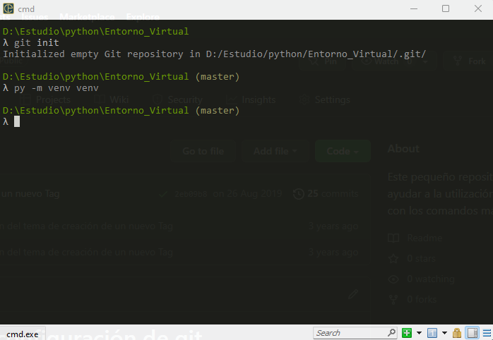

# ¿Cómo crear un entorno virtal?

En este caso se hará desde la terminal de [Cmder](https://cmder.net/). Uno de los requerimientos necesarios es tener previamente instalado [Python](https://www.python.org/) en la PC.

Primeramente, nos posicionamos en la carpeta donde estarán todos los archivos de nuestro repositorio; donde estarán todos documentos de códigos de nuestro proyecto. Y se escribe el siguiente comando:

```Bash
git init
```


**git init** es para inicializar el nuestro repositorio. Si quieres saber más sobre cómo utilizar **Git**, dar clic [aquí](https://github.com/Madera971003/aprendiendo_a_usar_git)

Después, se crea el entorno virtual con el comando de abajo (Suele tardar en crear el entorno). Hay que aclarar que se coloca dos veces **venv** porque uno es la llamada a la creación del entorno virtual y el otro el nombre del entorno virtual; tu puedes elegir el nombre, pero por convención se usa el mismo.

```Bash
py -m venv venv
```



Para **activar** o **desactivar** el entorno virtual se hace lo siguiente:

```Bash
.\venv\Scripts\activate # Activar el entorno

deactivate # Desactivar el entorno
```


Para facilitar el activar a desactivar el entorno, se puede crear un alias como el siguiente:

```Bash
alias avenv=.\venv\Scripts\activate
```


